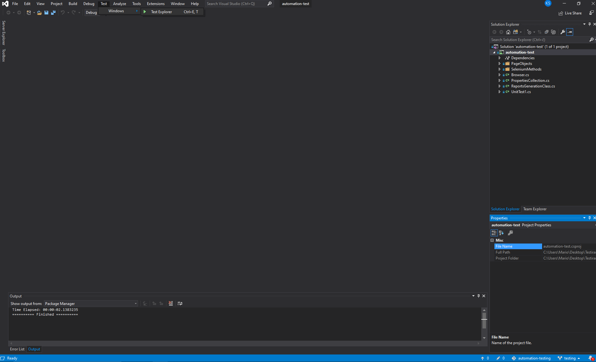
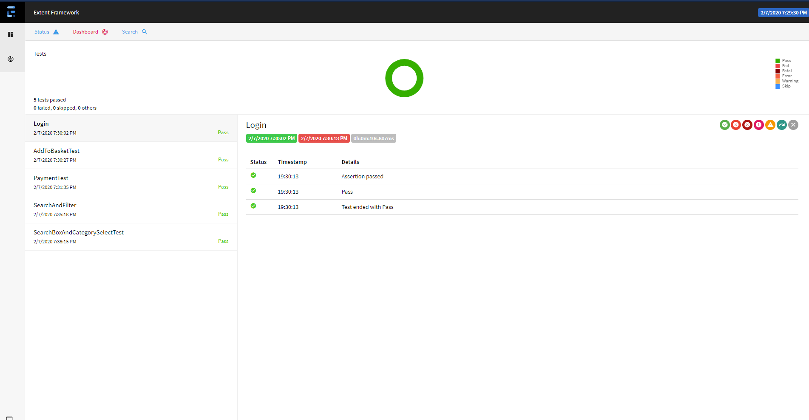

# Automation testing project for MTTP

    

## 1. About the project

### About the project

This project is created for the assignment at "Methods and Techinques of Software Testing" course at FERIT Osijek. 
In this project, automation testing was implemented for the website [HGSHOP](https://www.hgshop.hr/).

## 2. Project setup

You only need to have a visual studio installed to start this project. 
All the necessary tools are installed through the nuget packages.

Visual studio can be downloaded here - [Visual studio](https://visualstudio.microsoft.com/downloads/)

Reporting files are saved in folder ...\automation-test\bin\Debug\netcoreapp2.2

    

    

    

